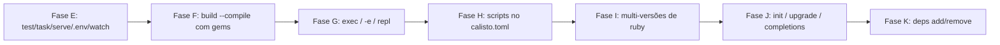

# Roadmap — calisto

> Alvo: **um Bun por inteiro para Ruby** — runtime gerenciado (CRuby pinado),
> startup fork-based, bundler, test/task/serve, build single-file com gems,
> scripts (bun run), exec (bunx), multi-versões. O valor está na orquestração:
> **nunca reimplementar o CRuby** (anti-objetivo nº 1). Cada fase tem marco
> verificável e vira teste permanente.

## Pronto (Fases 1-2 + A-E) — resumo

- [x] **Fase 1-2** — runtime pinado + daemon fork (startup 3-4×), `calisto build` stdlib-only
- [x] **Fase A (gems)** — `run` ativa o Gemfile via Bundler (semântica `bundle exec`), warn de `.ruby-version`, preload desativado com Gemfile
- [x] **Fase B (preload de app)** — `calisto.toml` + daemon dedicado por app, boot congelado, fork-safe (desconexão AR + `$LOADED_FEATURES`)
- [x] **Fase C (Rails mínimo)** — dev server e console como child do fork
- [x] **Fase D (escada real)** — degraus 1-5: stdlib → Sinatra → Rails → Maybe Finance (Sidekiq) → **Chatwoot** (API + ActionCable)
- [x] **Fase E (Produto Bun: test/task/serve/.env/watch)** — daemon **multi-conexão** (select + waitpid WNOHANG; child de longa duração não bloqueia novos RUNs), `calisto test` (minitest/rspec, daemon de teste dedicado RAILS_ENV=test com socket próprio, fork por arquivo em paralelo, `--watch` no cliente), `calisto task` (rake no daemon quente via `Gem.bin_path`, idem `bin/rake`), `calisto serve` (config.ru via rackup/rack como child do fork), `.env` (parser no cliente — paridade `--cold` preservada, sem sobrescrever vars existentes)

Números de hoje: Rails runner 2162ms → **108ms (20×)** no Chatwoot; 1527→177ms (8.6×) no Maybe; boot Rails 2.2s → 105ms; `calisto test` no railsapp: suite de 2 arquivos **<1s** quente (boot pago uma vez, <500ms/arquivo); `calisto task db:migrate` idempotente: 530ms frio → **98ms** quente. Golden tests gated em `test/{bundler,app,realapps,testcmd}.rs`.

## Fases futuras — em partes

### Fase E — Produto Bun: test / task / serve / .env / watch ✅
Crates esboçados (ainda vazios): `calisto-{test,task,serve,sqlite,tooling}`.

- [x] `calisto test` — detecta minitest/rspec do projeto, roda no daemon quente, paralelo
- [x] `calisto test --watch` — re-roda ao salvar (watcher no cliente Rust: polling de mtime — fork-safe, sem listen/inotify)
- [x] `calisto task` — rake no daemon quente (`calisto task db:migrate`)
- [x] `calisto serve` — HTTP (rackup/rack handler) como child do fork
- [x] `.env` loading (no cliente: spawn do daemon, env_blob do RUN e `--cold` herdam)
- Marco: `calisto test` roda a suíte do `railsapp` (minitest) **<1s total, <500ms/arquivo**; `calisto task db:migrate` idempotente no daemon. Fica: golden de uma suíte rspec real (o Maybe usa minitest na prática; a detecção `.rspec`/`spec/*_spec.rb` está testada, falta um fixture rspec de verdade)

### Fase F — build --compile com gems
- [ ] gems **pure-Ruby** embutidas no bundle (o loader já intercepta `require`)
- [ ] executável único roda app com gems **sem bundle install** (runtime próprio)
- [ ] C extensions (nokogiri, pg…): compile + link no build — o item "década"; só para apps sem C exts; provavelmente nunca para Rails completo (bun levou anos com time full-time)
- Marco: app Sinatra com 5 gems → `calisto build --compile` → executável → HTTP 200 sem rubygems/bundle no sistema
- Estimativa: 2-4 meses (C exts: estelar)

### Fase G — Execução (o bunx do Ruby)
- [ ] `calisto exec <bin>` — roda o binário de uma gem no contexto da app (ex.: `calisto exec rubocop`, `calisto exec sidekiq`) — o degrau 4/5 precisou de `bin/sidekiq` manual
- [ ] `calisto run -e 'code'` — código inline no daemon quente (hoje o help diz "sem VM flags")
- [ ] `calisto repl` — IRB no contexto da app pré-carregada
- Marco: `calisto exec sidekiq` no Maybe processa job; `calisto run -e 'puts 1+1'` warm **<50ms**
- Estimativa: 1-2 semanas

### Fase H — Scripts no calisto.toml (o package.json do Ruby)
- [ ] `[scripts]` no calisto.toml: `dev = "bin/rails server"`, `test = "rake test"`, `db:migrate = "bin/rails db:migrate"`…
- [ ] `calisto run dev` / `calisto run test` — executa o comando no daemon (com args)
- Marco: `calisto run dev` sobe o `railsapp`; `calisto run test` roda a suíte; `calisto run db:migrate` idempotente
- Estimativa: 1-2 semanas

### Fase I — Multi-versões de ruby (hoje: pin único 3.4.10)
- [ ] `vendor/rubies/<versão>/` (o build-ruby.sh já é parametrizável) — seleção por `.ruby-version`/Gemfile
- [ ] daemon por versão (hash do socket inclui a versão)
- [ ] bundle por versão (GEM_HOME de cada vendor) — C exts compilam por versão (setup libpq/libyaml já vale)
- Marco: Maybe e Chatwoot (pinam 3.4.4) rodam **sem editar o Gemfile**; app 3.2.x roda; `.ruby-version` divergente → erro claro se a versão não está instalada (hoje: só warn)
- Nota: 3.0/3.1 são EOL — o valor prático é 3.2/3.3/3.4; ~274MB + 10-15min por versão
- Estimativa: 1-2 semanas

### Fase J — init / upgrade / completions
- [ ] `calisto init` — scaffold (calisto.toml + estrutura mínima), como `bun init`
- [ ] `calisto upgrade` — rebuild do pin / troca de versão (idempotente)
- [ ] `calisto completions` — bash/zsh
- Marco: `calisto init meu-app` gera app que roda com `calisto run`; `upgrade` idempotente
- Estimativa: 1 semana

### Fase K — deps (UX Bun, delegando ao Bundler)
- [ ] `calisto add <gem>` / `calisto remove <gem>` — **wrapper fino** do `bundle add/remove` com o ruby da versão certa (decisão da Fase A: nada de instalador próprio)
- [ ] `calisto lock` — `bundle lock`
- Marco: `calisto add sinatra` num projeto → `calisto run` ativa sem passos manuais
- Estimativa: 1 semana

## Riscos técnicos conhecidos

- **Memória**: daemon com Chatwoot pré-carregado ≈ 500MB+ RSS (preço do preload)
- **Watch/fork**: o listen (inotify) quebra o 2º fork (descoberto no Chatwoot) — o watch da Fase E roda no cliente Rust (polling de mtime), fork-safe por construção
- **C exts no build**: limitação estrutural da Fase F
- **Windows**: impossível (fork)
- **Não fazer**: reimplementar Bundler, reimplementar o CRuby, bundle de C exts no curto prazo
