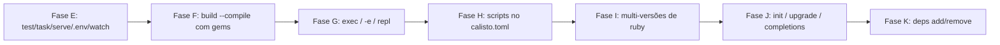

# Roadmap — calisto

> Alvo: **um Bun por inteiro para Ruby** — runtime gerenciado (CRuby pinado),
> startup fork-based, bundler, test/task/serve, build single-file com gems,
> scripts (bun run), exec (bunx), multi-versões. O valor está na orquestração:
> **nunca reimplementar o CRuby** (anti-objetivo nº 1). Cada fase tem marco
> verificável e vira teste permanente.

## Pronto (Fases 1-2 + A-K) — resumo

- [x] **Fase 1-2** — runtime pinado + daemon fork (startup 3-4×), `calisto build` stdlib-only
- [x] **Fase A (gems)** — `run` ativa o Gemfile via Bundler (semântica `bundle exec`), warn de `.ruby-version`, preload desativado com Gemfile
- [x] **Fase B (preload de app)** — `calisto.toml` + daemon dedicado por app, boot congelado, fork-safe (desconexão AR + `$LOADED_FEATURES`)
- [x] **Fase C (Rails mínimo)** — dev server e console como child do fork
- [x] **Fase D (escada real)** — degraus 1-5: stdlib → Sinatra → Rails → Maybe Finance (Sidekiq) → **Chatwoot** (API + ActionCable)
- [x] **Fase E (Produto Bun: test/task/serve/.env/watch)** — daemon **multi-conexão** (select + waitpid WNOHANG; child de longa duração não bloqueia novos RUNs), `calisto test` (minitest/rspec, daemon de teste dedicado RAILS_ENV=test com socket próprio, fork por arquivo em paralelo, `--watch` no cliente), `calisto task` (rake no daemon quente via `Gem.bin_path`, idem `bin/rake`), `calisto serve` (config.ru via rackup/rack como child do fork), `.env` (parser no cliente — paridade `--cold` preservada, sem sobrescrever vars existentes)
- [x] **Fase F (build --compile com gems)** — embute as gems do Gemfile.lock: **pure-Ruby** (.rb avaliados; autoload coberto) e **C extensions** (.so/.bundle já compilados embutidos como bytes, extraídos p/ tmpdir no runtime — cobre require dinâmico via pré-índice, ex.: sqlite3). O bundle roda com `GEM_HOME`/`GEM_PATH` vazios; compilar do zero continua delegado ao `bundle install` (sem toolchain própria)
- [x] **Fase G (Execução: exec / -e / repl)** — `calisto exec <bin>` (resolve como `bundle exec` sem binstub: caminho de arquivo → spec ativada do bundle → PATH; binário ruby é `load` in-process como o kernel_load do bundler; ambíguo → erro com candidatos; inexistente → 127), `calisto run -e 'code'` (op `EVAL` no daemon — paridade exata com `ruby -e`: $0 = "-e", backtrace `-e:1`, sem DATA, múltiplos `-e` concatenados), `calisto repl` (IRB como child do fork no contexto da app pré-carregada)
- [x] **Fase H (Scripts: o package.json do Ruby)** — `[scripts]` no calisto.toml (nome = comando, tokenizado shell-like com aspas); `calisto run <script>` resolve nome que não é arquivo para o comando (arquivo existente sempre vence), roda como `calisto exec` no daemon (fork do boot congelado da app quando há `[run] preload`; daemon genérico num calisto.toml só de scripts — `preload` passou a ser opcional), args do CLI vão ao final do comando; `--cold` roda o shim no interpretador direto (paridade cold/warm)
- [x] **Fase I (Multi-versões de ruby)** — seleção por `.ruby-version` (walk up, `ruby-` tolerado) ou diretiva `ruby "x.y.z"`/`ruby file:` do Gemfile → `vendor/ruby-<v>/bin/ruby`; versão não instalada → **erro claro** com o comando de build. Daemons isolados por versão (genérico em `runtime_dir/ruby-<v>/`; hash do socket da app inclui a versão — pin default mantém o hash clássico). Bundle por versão: `bundle install` roda no ruby da versão (gate `bundle_check` do harness respeita a versão). Fix estrutural: o daemon não ativa default gems antes do `Bundler.setup` (decoder base64 hand-rolled em vez de `require "base64"`) e o `-rbundler/setup` do daemon da app virou flag real (antes era ARGV — ruby ignora flag após o script). Marco: Maybe/Chatwoot (pinam 3.4.4) rodam sem editar o Gemfile — 2º comando **203ms/134ms**, goldens realapps verdes sob 3.4.4

- [x] **Fase J (Ciclo de vida: init / upgrade / completions)** — `calisto init [name]` (scaffold como `bun init`: calisto.toml com `[scripts] start = "./hello.rb"` + hello.rb executável com shebang + .gitignore; nunca sobrescreve sem `--force`), `calisto run` **bare** roda o `start` do calisto.toml (convenção npm/bun — sem `start`, erro de uso como antes), `calisto upgrade [version]` (roda `scripts/build-ruby.sh`: rebuild do pin ou build de `vendor/ruby-<v>`; idempotente; versão sem sha conhecido → erro claro antes de spawnar; exit code do script propaga), `calisto completions bash|zsh` (scripts instaláveis). Marco: `calisto init meu-app` → `calisto run` **33ms** quente no scaffold.
- [x] **Fase K (deps: o bun add do Ruby)** — `calisto add/remove/lock` = **wrapper fino** do `bundle add/remove/lock` com o ruby da versão certa (Fase I) e cwd na raiz do projeto (walk-up do Gemfile); PATH prefixado com o bin dir do ruby (trap do restart do bundler). Marco: `calisto add sinatra` num projeto → `calisto run` ativa sem passos manuais (Sinatra 4.2.1 no daemon quente).

Números de hoje: Rails runner 2162ms → **108ms (20×)** no Chatwoot; 1527→177ms (8.6×) no Maybe; boot Rails 2.2s → 105ms; `calisto test` no railsapp: suite de 2 arquivos **<1s** quente (boot pago uma vez, <500ms/arquivo); `calisto task db:migrate` idempotente: 530ms frio → **98ms** quente; `calisto run -e 'puts 1+1'` quente **36ms** (marco <50ms); `calisto exec sidekiq -r <app>` no Maybe processa o `CalistoProbeJob` (golden realapps); `calisto run db:migrate` quente **135ms** e `calisto run test <filtro>` **74ms** no railsapp (Fase H); sob 3.4.4 (Fase I): maybe 2º comando **203ms**, chatwoot **134ms**, `run -e` **34ms**; scaffold do `calisto init` (Fase J): 2º `run` **33ms**, `run -e` **22ms**; bundle com C-ext (Fase F): `sqlite3` (require dinâmico) e `puma` rodam com `GEM_PATH` vazio; `calisto add sinatra` → `calisto run` ativa (Fase K). Golden tests gated em `test/{bundler,app,realapps,testcmd,exec,scripts,versions,tooling,deps}.rs`.

## Fases futuras — em partes

### Fase E — Produto Bun: test / task / serve / .env / watch ✅
Crates esboçados (ainda vazios): `calisto-{test,task,serve,sqlite,tooling}`.

- [x] `calisto test` — detecta minitest/rspec do projeto, roda no daemon quente, paralelo
- [x] `calisto test --watch` — re-roda ao salvar (watcher no cliente Rust: polling de mtime — fork-safe, sem listen/inotify)
- [x] `calisto task` — rake no daemon quente (`calisto task db:migrate`)
- [x] `calisto serve` — HTTP (rackup/rack handler) como child do fork
- [x] `.env` loading (no cliente: spawn do daemon, env_blob do RUN e `--cold` herdam)
- Marco: `calisto test` roda a suíte do `railsapp` (minitest) **<1s total, <500ms/arquivo**; `calisto task db:migrate` idempotente no daemon. **Golden rspec real validado no Chatwoot** (119 examples em `account`+`user`+`label_spec`): `bundle exec rspec` frio **5006ms** → `calisto test` quente **698ms (7.2×)**, 1ª execução (com boot) 2509ms — os 3 arquivos rodam em paralelo via accept loop multi-conexão. Nota: o Chatwoot locka bundler 2.5.16 e o ruby 3.4.10 embute 2.6.9 — o `require 'bundler/setup'` frio dispara `Bundler::SelfManager#restart_with_locked_bundler_if_needed`, que re-executa o processo via shebang (precisa de ruby no PATH); o daemon warm não é afetado (o restart acontece no boot sem shebang, o child herda o bundler ativo)

### Fase F — build --compile com gems ✅
- [x] gems **pure-Ruby** embutidas no bundle (o loader intercepta `require` por nome; `autoload` das gems coberto — pré-carga dos alvos em rodadas; `require_relative` delegado com caminho absoluto)
- [x] executável único roda app com gems **sem bundle install** (roda com `GEM_HOME`/`GEM_PATH` vazios)
- [x] C extensions: **link no build** — os `.so`/`.bundle` já compilados no GEM_PATH da app são embutidos como bytes (base64) e extraídos p/ tmpdir no runtime (dlopen do caminho absoluto). Cobre gems precompiladas (sqlite3-x86_64-linux: `.so` no lib, require **dinâmico** `"sqlite3/#{RUBY_VERSION}/sqlite3_native"` → pré-índice pelo nome canônico) e gems compiladas pelo bundle install (dir `extensions/`: puma, nio4r, json…). **Compilar do zero no build continua delegado ao `bundle install`** (decisão da Fase A: sem toolchain própria — a parte "década" era o mkmf; o `.so` depende das libs do sistema, ex.: libsqlite3/libxml2)
- Marco ✅: Sinatra + 10 gems (sinatra/rack/rack-test/rack-protection/rack-session/rackup/mustermann/tilt/base64/logger) → `calisto build --compile smoke.rb` → roda com `GEM_PATH` vazio → **HTTP 200** (smoke via rack-test em memória). **Novo marco (C exts)**: `require "sqlite3"` no railsapp → bundle com `GEM_PATH` vazio imprime `SQLite3::SQLITE_VERSION` (require dinâmico + precompilada) e `require "puma"` no sinatraapp → `Puma::Const::VERSION` 8.x (compilada pelo bundle install) — `test/build.rs` gated em bundle install. Notas: bug do CRuby 3.4 (autoload registrado via `eval` dispara na definição do const) contornado no loader; gems são resolvidas via `Gem::Specification.find_by_name` com o GEM_PATH do app (vendor/bundle); armadilha do Ruby 3.4: `Hash#each` com bloco de aridade 1 entrega `[k, v]` — o coletor de nativos usa `each_key`.

### Fase G — Execução (o bunx do Ruby) ✅
- [x] `calisto exec <bin>` — roda o binário de uma gem no contexto da app (ex.: `calisto exec rubocop`, `calisto exec sidekiq`) — o degrau 4/5 precisou de `bin/sidekiq` manual
- [x] `calisto run -e 'code'` — código inline no daemon quente (op `EVAL` no daemon; paridade exata com `ruby -e`: $0/ARGV/backtrace `-e:1`/sem DATA; múltiplos `-e` concatenados; cold via `ruby -e`)
- [x] `calisto repl` — IRB no contexto da app pré-carregada (child do fork do daemon da app, como o console da Fase C)
- Marco ✅: `calisto exec sidekiq` no Maybe processa o `CalistoProbeJob` (golden realapps — worker via `exec sidekiq -r <app>`, require path do CLI 8); `calisto run -e 'puts 1+1'` warm **36ms** (marco <50ms, 2º run do daemon genérico; `-e` no daemon da app com Rails ≈ 440ms — fork do VM grande). Detalhes de implementação: resolução estilo `bundle exec` sem binstub (caminho de arquivo → `Gem.loaded_specs` com dedup por nome — default gems aparecem 2× — → PATH; ambíguo entre gems DIFERENTES → erro com candidatos; inexistente → 127), binário ruby via `load` in-process (kernel_load do bundler: $0 = caminho, ARGV = args — sem shebang/re-exec), nativo via `exec` (126/127). Daemon: `child_enter` (bootstrap comum) + `start_child_eval`.
- Estimativa: ~~1-2 semanas~~ (concluída)

### Fase H — Scripts no calisto.toml (o package.json do Ruby) ✅
- [x] `[scripts]` no calisto.toml: `dev = "bin/rails server"`, `test = "rake test"`, `db:migrate = "bin/rails db:migrate"`… (subset do TOML: `chave = "valor"`, sem escapes; comando tokenizado shell-like — aspas simples/duplas agrupam, sem expansão)
- [x] `calisto run dev` / `calisto run test` — nome que não é arquivo resolve para `[scripts.NAME]` (arquivo existente sempre vence) e roda como `calisto exec` no daemon, com os args do CLI no final do comando; `--cold` roda o shim no interpretador direto (paridade cold/warm)
- [x] `preload` opcional no parser: calisto.toml só com `[scripts]` não vira daemon da app (usa o daemon genérico); `status`/`stop`/`doctor` respeitam a mesma regra
- Marco ✅: `calisto run dev` sobe o railsapp (GET /up → 200, `-p`/`-b` repassados ao script); `calisto run test` roda a suite via `bin/rails test` no daemon dev (o teste de env falha POR DESIGN — Rails.env fica "development" no boot congelado; é exatamente a razão do daemon de teste RAILS_ENV=test do `calisto test`); `calisto run db:migrate` idempotente (135ms quente). Fixture hermética `scriptsapp` (só scripts, sem preload) + `[scripts]` na `preloadapp` (boot UMA vez) e na `railsapp` (golden, gated em bundle install) — `test/scripts.rs`, 9 testes.
- Detalhe de implementação: resolução reusa o `exec_argv` do Fase G (`exec.rb` shim: caminho de arquivo → spec do bundle → PATH; `load` in-process); cwd do child = raiz da app (dir do calisto.toml), como bun run; scripts não entram no hash do socket do daemon (mudar script não reinicia o daemon).
- Estimativa: ~~1-2 semanas~~ (concluída)

### Fase I — Multi-versões de ruby (hoje: pin único 3.4.10) ✅
- [x] seleção por `.ruby-version` (walk up, prefixo `ruby-` tolerado) ou diretiva `ruby "x.y.z"`/`ruby file:` do Gemfile → `vendor/ruby-<v>/bin/ruby`; sem pedido, `vendor/current` (pin 3.4.10). `build-ruby.sh` com sha conhecido por versão (3.4.10/3.4.4) e `vendor/current` que NÃO troca ao construir versão extra
- [x] daemon por versão: genérico em `runtime_dir/ruby-<v>/` (socket próprio por VM); daemon da app com a versão no hash do socket (pin default mantém o hash clássico — sem órfãos); `status`/`stop`/`doctor` respeitam a versão do cwd
- [x] bundle por versão: `bundle install`/`bundle check` rodam no ruby da versão (o gate `bundle_check` do harness resolve `.ruby-version`/Gemfile) — o lock do maybe/chatwoot foi regenerado sob 3.4.4 (ex.: base64 0.2.0 vs 0.3.0 do 3.4.10)
- [x] fix estrutural (default gems): o daemon não faz mais `require "base64"` no boot — decoder hand-rolled (mesmo alfabeto do cliente Rust) — e o `-rbundler/setup` do daemon da app virou flag REAL antes do script (antes era ARGV: `ruby script.rb -r...` não é flag). Sem isso, o `Bundler.require` da app falhava "already activated base64 0.2.0" sob 3.4.4
- Marco ✅: Maybe e Chatwoot (pinam **3.4.4** nativamente — os pins 3.4.10 da Fase D revertidos) rodam **sem editar o Gemfile**: 2º comando **203ms** (maybe) / **134ms** (chatwoot), goldens realapps verdes sob 3.4.4 (sidekiq probe + API + ActionCable); `.ruby-version` com versão não instalada → **erro claro** com o comando de build (substitui o warning da Fase 1-2). `test/versions.rs` (5 testes): seleção, cold/warm, Gemfile, erro, isolamento de daemons genérico e da app por versão
- Nota: 3.0/3.1 são EOL — o valor prático é 3.2/3.3/3.4; ~274MB + 10-15min por versão
- Estimativa: ~~1-2 semanas~~ (concluída)

### Fase J — init / upgrade / completions ✅
- [x] `calisto init` — scaffold (calisto.toml + estrutura mínima), como `bun init`
- [x] `calisto upgrade` — rebuild do pin / troca de versão (idempotente)
- [x] `calisto completions` — bash/zsh
- Marco ✅: `calisto init meu-app` gera app que roda com `calisto run` (BARE — `run` sem script com `[scripts] start` roda o start, convenção npm/bun; sem `start` continua o erro de uso) e com `calisto run hello.rb` (arquivo sempre vence); `--cold` concorda; upgrade idempotente (o script pula rubies já construídos) — o exit code do script de build propaga e versão sem sha conhecido (3.4.10/3.4.4) falha ANTES de spawnar. `test/tooling.rs`, 6 testes.
- Detalhe de implementação: init gera hello.rb **executável** (shebang `#!/usr/bin/env ruby` + 755) — o shim do `exec` (que os scripts usam) resolve executáveis e detecta binário ruby pelo shebang para `load` in-process, sem depender de ruby no PATH. `upgrade` roda `<vendor>/../scripts/build-ruby.sh` via `sh` com stdio herdado (progresso ao vivo); `CALISTO_BUILD_SCRIPT` override para testes (mesmo padrão do `CALISTO_RUBY`). Completions: bash (`complete -F`) e zsh (`#compdef`), com flags por subcomando e `*.rb`.
- Estimativa: ~~1 semana~~ (concluída)

### Fase K — deps (UX Bun, delegando ao Bundler) ✅
- [x] `calisto add <gem>` / `calisto remove <gem>` — **wrapper fino** do `bundle add/remove` com o ruby da versão certa (decisão da Fase A: nada de instalador próprio)
- [x] `calisto lock` — `bundle lock`
- Marco ✅: `calisto add sinatra` num projeto → `calisto run -e 'require "sinatra"'` ativa **sem passos manuais** (Sinatra 4.2.1 no daemon quente). Detalhes: wrapper roda `ruby -S bundle ` com o ruby resolvido (Fase I — `.ruby-version`/Gemfile) e cwd na **raiz do projeto** (walk-up do Gemfile, como o resto do calisto), `BUNDLE_GEMFILE` setado, PATH prefixado com o bin dir do ruby (trap do restart do bundler: lock que pina outro bundler re-executa via shebang) e `CALISTO_BUNDLE_RUBY` exportado; `CALISTO_BUNDLE` (testes) troca o binário — `test/deps.rs`, 5 testes (passthrough de args, cwd/Gemfile/ruby certos, exit code, versão 3.4.4 gated, sem Gemfile → erro sugerindo `bundle init`).
- Estimativa: ~~1 semana~~ (concluída)

## Riscos técnicos conhecidos

- **Memória**: daemon com Chatwoot pré-carregado ≈ 500MB+ RSS (preço do preload)
- **Watch/fork**: o listen (inotify) quebra o 2º fork (descoberto no Chatwoot) — o watch da Fase E roda no cliente Rust (polling de mtime), fork-safe por construção
- **C exts no build**: .so embutidos dependem das libs do sistema (libsqlite3/libxml2/libpq) e do ABI da plataforma onde o `bundle install` compilou; compilar do zero no build continua delegado ao bundler (sem toolchain própria)
- **Windows**: impossível (fork)
- **Não fazer**: reimplementar Bundler, reimplementar o CRuby, compilar C exts no build (mkmf) — o link/embed já está feito; compilar continua com o `bundle install`
