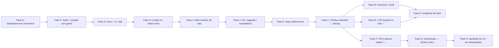

# Roadmap — calisto

> Alvo: **um Bun por inteiro para Ruby** — runtime gerenciado (CRuby pinado),
> startup fork-based, bundler, test/task/serve, build single-file com gems,
> scripts (bun run), exec (bunx), multi-versões. O valor está na orquestração:
> **nunca reimplementar o CRuby** (anti-objetivo nº 1). Cada fase tem marco
> verificável e vira teste permanente.



## Pronto (Fases 1-2 + A-K) — resumo

- [x] **Fase 1-2** — runtime pinado + daemon fork (startup 3-4×), `calisto build` stdlib-only
- [x] **Fase A (gems)** — `run` ativa o Gemfile via Bundler (semântica `bundle exec`), warn de `.ruby-version`, preload desativado com Gemfile
- [x] **Fase B (preload de app)** — `calisto.toml` + daemon dedicado por app, boot congelado, fork-safe (desconexão AR + `$LOADED_FEATURES`)
- [x] **Fase C (Rails mínimo)** — dev server e console como child do fork
- [x] **Fase D (escada real)** — degraus 1-5: stdlib → Sinatra → Rails → Maybe Finance (Sidekiq) → **Chatwoot** (API + ActionCable)
- [x] **Fase E (Produto Bun: test/task/serve/.env/watch)** — daemon **multi-conexão** (select + waitpid WNOHANG; child de longa duração não bloqueia novos RUNs), `calisto test` (minitest/rspec, daemon de teste dedicado RAILS_ENV=test com socket próprio, fork por arquivo em paralelo, `--watch` no cliente), `calisto task` (rake no daemon quente via `Gem.bin_path`, idem `bin/rake`), `calisto serve` (config.ru via rackup/rack como child do fork), `.env` (parser no cliente — paridade `--cold` preservada, sem sobrescrever vars existentes)
- [x] **Fase F (build --compile com gems)** — embute as gems do Gemfile.lock: **pure-Ruby** (.rb avaliados; autoload coberto) e **C extensions** (.so/.bundle já compilados embutidos como bytes, extraídos p/ tmpdir no runtime — cobre require dinâmico via pré-índice, ex.: sqlite3). O bundle roda com `GEM_HOME`/`GEM_PATH` vazios; compilar do zero continua delegado ao `bundle install` (sem toolchain própria)
- [x] **Fase G (Execução: exec / -e / repl)** — `calisto exec <bin>` (resolve como `bundle exec` sem binstub: caminho de arquivo → spec ativada do bundle → PATH; binário ruby é `load` in-process como o kernel_load do bundler; ambíguo → erro com candidatos; inexistente → 127), `calisto run -e 'code'` (op `EVAL` no daemon — paridade exata com `ruby -e`: $0 = "-e", backtrace `-e:1`, sem DATA, múltiplos `-e` concatenados), `calisto repl` (IRB como child do fork no contexto da app pré-carregada)
- [x] **Fase H (Scripts: o package.json do Ruby)** — `[scripts]` no calisto.toml (nome = comando, tokenizado shell-like com aspas); `calisto run <script>` resolve nome que não é arquivo para o comando (arquivo existente sempre vence), roda como `calisto exec` no daemon (fork do boot congelado da app quando há `[run] preload`; daemon genérico num calisto.toml só de scripts — `preload` passou a ser opcional), args do CLI vão ao final do comando; `--cold` roda o shim no interpretador direto (paridade cold/warm)
- [x] **Fase I (Multi-versões de ruby)** — seleção por `.ruby-version` (walk up, `ruby-` tolerado) ou diretiva `ruby "x.y.z"`/`ruby file:` do Gemfile → `vendor/ruby-<v>/bin/ruby`; versão não instalada → **erro claro** com o comando de build. Daemons isolados por versão (genérico em `runtime_dir/ruby-<v>/`; hash do socket da app inclui a versão — pin default mantém o hash clássico). Bundle por versão: `bundle install` roda no ruby da versão (gate `bundle_check` do harness respeita a versão). Fix estrutural: o daemon não ativa default gems antes do `Bundler.setup` (decoder base64 hand-rolled em vez de `require "base64"`) e o `-rbundler/setup` do daemon da app virou flag real (antes era ARGV — ruby ignora flag após o script). Marco: Maybe/Chatwoot (pinam 3.4.4) rodam sem editar o Gemfile — 2º comando **203ms/134ms**, goldens realapps verdes sob 3.4.4

- [x] **Fase J (Ciclo de vida: init / upgrade / completions)** — `calisto init [name]` (scaffold como `bun init`: calisto.toml com `[scripts] start = "./hello.rb"` + hello.rb executável com shebang + .gitignore; nunca sobrescreve sem `--force`), `calisto run` **bare** roda o `start` do calisto.toml (convenção npm/bun — sem `start`, erro de uso como antes), `calisto upgrade [version]` (roda `scripts/build-ruby.sh`: rebuild do pin ou build de `vendor/ruby-<v>`; idempotente; versão sem sha conhecido → erro claro antes de spawnar; exit code do script propaga), `calisto completions bash|zsh` (scripts instaláveis). Marco: `calisto init meu-app` → `calisto run` **33ms** quente no scaffold.
- [x] **Fase K (deps: o bun add do Ruby)** — `calisto add/remove/lock` = **wrapper fino** do `bundle add/remove/lock` com o ruby da versão certa (Fase I) e cwd na raiz do projeto (walk-up do Gemfile); PATH prefixado com o bin dir do ruby (trap do restart do bundler). Marco: `calisto add sinatra` num projeto → `calisto run` ativa sem passos manuais (Sinatra 4.2.1 no daemon quente).

Números de hoje: Rails runner 2162ms → **108ms (20×)** no Chatwoot; 1527→177ms (8.6×) no Maybe; boot Rails 2.2s → 105ms; `calisto test` no railsapp: suite de 2 arquivos **<1s** quente (boot pago uma vez, <500ms/arquivo); `calisto task db:migrate` idempotente: 530ms frio → **98ms** quente; `calisto run -e 'puts 1+1'` quente **36ms** (marco <50ms); `calisto exec sidekiq -r <app>` no Maybe processa o `CalistoProbeJob` (golden realapps); `calisto run db:migrate` quente **135ms** e `calisto run test <filtro>` **74ms** no railsapp (Fase H); sob 3.4.4 (Fase I): maybe 2º comando **203ms**, chatwoot **134ms**, `run -e` **34ms**; scaffold do `calisto init` (Fase J): 2º `run` **33ms**, `run -e` **22ms**; bundle com C-ext (Fase F): `sqlite3` (require dinâmico) e `puma` rodam com `GEM_PATH` vazio; compactação pré-fork (Fase M): **Private_Dirty do child do Chatwoot −46%** (96.9→52.3 MiB; Pss −15% — a metade compartilhada dilui o Pss), medido pelo `calisto doctor` (smaps_rollup do daemon + child de probe); `calisto add sinatra` → `calisto run` ativa (Fase K). Golden tests gated em `test/{bundler,app,realapps,testcmd,exec,scripts,versions,tooling,deps}.rs`.

## Fases futuras — em partes

### Fase E — Produto Bun: test / task / serve / .env / watch ✅
Crates esboçados (ainda vazios): `calisto-{test,task,serve,sqlite,tooling}`.

- [x] `calisto test` — detecta minitest/rspec do projeto, roda no daemon quente, paralelo
- [x] `calisto test --watch` — re-roda ao salvar (watcher no cliente Rust: polling de mtime — fork-safe, sem listen/inotify)
- [x] `calisto task` — rake no daemon quente (`calisto task db:migrate`)
- [x] `calisto serve` — HTTP (rackup/rack handler) como child do fork
- [x] `.env` loading (no cliente: spawn do daemon, env_blob do RUN e `--cold` herdam)
- Marco: `calisto test` roda a suíte do `railsapp` (minitest) **<1s total, <500ms/arquivo**; `calisto task db:migrate` idempotente no daemon. **Golden rspec real validado no Chatwoot** (119 examples em `account`+`user`+`label_spec`): `bundle exec rspec` frio **5006ms** → `calisto test` quente **698ms (7.2×)**, 1ª execução (com boot) 2509ms — os 3 arquivos rodam em paralelo via accept loop multi-conexão. Nota: o Chatwoot locka bundler 2.5.16 e o ruby 3.4.10 embute 2.6.9 — o `require 'bundler/setup'` frio dispara `Bundler::SelfManager#restart_with_locked_bundler_if_needed`, que re-executa o processo via shebang (precisa de ruby no PATH); o daemon warm não é afetado (o restart acontece no boot sem shebang, o child herda o bundler ativo)

### Fase F — build --compile com gems ✅
- [x] gems **pure-Ruby** embutidas no bundle (o loader intercepta `require` por nome; `autoload` das gems coberto — pré-carga dos alvos em rodadas; `require_relative` delegado com caminho absoluto)
- [x] executável único roda app com gems **sem bundle install** (roda com `GEM_HOME`/`GEM_PATH` vazios)
- [x] C extensions: **link no build** — os `.so`/`.bundle` já compilados no GEM_PATH da app são embutidos como bytes (base64) e extraídos p/ tmpdir no runtime (dlopen do caminho absoluto). Cobre gems precompiladas (sqlite3-x86_64-linux: `.so` no lib, require **dinâmico** `"sqlite3/#{RUBY_VERSION}/sqlite3_native"` → pré-índice pelo nome canônico) e gems compiladas pelo bundle install (dir `extensions/`: puma, nio4r, json…). **Compilar do zero no build continua delegado ao `bundle install`** (decisão da Fase A: sem toolchain própria — a parte "década" era o mkmf; o `.so` depende das libs do sistema, ex.: libsqlite3/libxml2)
- Marco ✅: Sinatra + 10 gems (sinatra/rack/rack-test/rack-protection/rack-session/rackup/mustermann/tilt/base64/logger) → `calisto build --compile smoke.rb` → roda com `GEM_PATH` vazio → **HTTP 200** (smoke via rack-test em memória). **Novo marco (C exts)**: `require "sqlite3"` no railsapp → bundle com `GEM_PATH` vazio imprime `SQLite3::SQLITE_VERSION` (require dinâmico + precompilada) e `require "puma"` no sinatraapp → `Puma::Const::VERSION` 8.x (compilada pelo bundle install) — `test/build.rs` gated em bundle install. Notas: bug do CRuby 3.4 (autoload registrado via `eval` dispara na definição do const) contornado no loader; gems são resolvidas via `Gem::Specification.find_by_name` com o GEM_PATH do app (vendor/bundle); armadilha do Ruby 3.4: `Hash#each` com bloco de aridade 1 entrega `[k, v]` — o coletor de nativos usa `each_key`.

### Fase G — Execução (o bunx do Ruby) ✅
- [x] `calisto exec <bin>` — roda o binário de uma gem no contexto da app (ex.: `calisto exec rubocop`, `calisto exec sidekiq`) — o degrau 4/5 precisou de `bin/sidekiq` manual
- [x] `calisto run -e 'code'` — código inline no daemon quente (op `EVAL` no daemon; paridade exata com `ruby -e`: $0/ARGV/backtrace `-e:1`/sem DATA; múltiplos `-e` concatenados; cold via `ruby -e`)
- [x] `calisto repl` — IRB no contexto da app pré-carregada (child do fork do daemon da app, como o console da Fase C)
- Marco ✅: `calisto exec sidekiq` no Maybe processa o `CalistoProbeJob` (golden realapps — worker via `exec sidekiq -r <app>`, require path do CLI 8); `calisto run -e 'puts 1+1'` warm **36ms** (marco <50ms, 2º run do daemon genérico; `-e` no daemon da app com Rails ≈ 440ms — fork do VM grande). Detalhes de implementação: resolução estilo `bundle exec` sem binstub (caminho de arquivo → `Gem.loaded_specs` com dedup por nome — default gems aparecem 2× — → PATH; ambíguo entre gems DIFERENTES → erro com candidatos; inexistente → 127), binário ruby via `load` in-process (kernel_load do bundler: $0 = caminho, ARGV = args — sem shebang/re-exec), nativo via `exec` (126/127). Daemon: `child_enter` (bootstrap comum) + `start_child_eval`.
- Estimativa: ~~1-2 semanas~~ (concluída)

### Fase H — Scripts no calisto.toml (o package.json do Ruby) ✅
- [x] `[scripts]` no calisto.toml: `dev = "bin/rails server"`, `test = "rake test"`, `db:migrate = "bin/rails db:migrate"`… (subset do TOML: `chave = "valor"`, sem escapes; comando tokenizado shell-like — aspas simples/duplas agrupam, sem expansão)
- [x] `calisto run dev` / `calisto run test` — nome que não é arquivo resolve para `[scripts.NAME]` (arquivo existente sempre vence) e roda como `calisto exec` no daemon, com os args do CLI no final do comando; `--cold` roda o shim no interpretador direto (paridade cold/warm)
- [x] `preload` opcional no parser: calisto.toml só com `[scripts]` não vira daemon da app (usa o daemon genérico); `status`/`stop`/`doctor` respeitam a mesma regra
- Marco ✅: `calisto run dev` sobe o railsapp (GET /up → 200, `-p`/`-b` repassados ao script); `calisto run test` roda a suite via `bin/rails test` no daemon dev (o teste de env falha POR DESIGN — Rails.env fica "development" no boot congelado; é exatamente a razão do daemon de teste RAILS_ENV=test do `calisto test`); `calisto run db:migrate` idempotente (135ms quente). Fixture hermética `scriptsapp` (só scripts, sem preload) + `[scripts]` na `preloadapp` (boot UMA vez) e na `railsapp` (golden, gated em bundle install) — `test/scripts.rs`, 9 testes.
- Detalhe de implementação: resolução reusa o `exec_argv` do Fase G (`exec.rb` shim: caminho de arquivo → spec do bundle → PATH; `load` in-process); cwd do child = raiz da app (dir do calisto.toml), como bun run; scripts não entram no hash do socket do daemon (mudar script não reinicia o daemon).
- Estimativa: ~~1-2 semanas~~ (concluída)

### Fase I — Multi-versões de ruby (hoje: pin único 3.4.10) ✅
- [x] seleção por `.ruby-version` (walk up, prefixo `ruby-` tolerado) ou diretiva `ruby "x.y.z"`/`ruby file:` do Gemfile → `vendor/ruby-<v>/bin/ruby`; sem pedido, `vendor/current` (pin 3.4.10). `build-ruby.sh` com sha conhecido por versão (3.4.10/3.4.4) e `vendor/current` que NÃO troca ao construir versão extra
- [x] daemon por versão: genérico em `runtime_dir/ruby-<v>/` (socket próprio por VM); daemon da app com a versão no hash do socket (pin default mantém o hash clássico — sem órfãos); `status`/`stop`/`doctor` respeitam a versão do cwd
- [x] bundle por versão: `bundle install`/`bundle check` rodam no ruby da versão (o gate `bundle_check` do harness resolve `.ruby-version`/Gemfile) — o lock do maybe/chatwoot foi regenerado sob 3.4.4 (ex.: base64 0.2.0 vs 0.3.0 do 3.4.10)
- [x] fix estrutural (default gems): o daemon não faz mais `require "base64"` no boot — decoder hand-rolled (mesmo alfabeto do cliente Rust) — e o `-rbundler/setup` do daemon da app virou flag REAL antes do script (antes era ARGV: `ruby script.rb -r...` não é flag). Sem isso, o `Bundler.require` da app falhava "already activated base64 0.2.0" sob 3.4.4
- Marco ✅: Maybe e Chatwoot (pinam **3.4.4** nativamente — os pins 3.4.10 da Fase D revertidos) rodam **sem editar o Gemfile**: 2º comando **203ms** (maybe) / **134ms** (chatwoot), goldens realapps verdes sob 3.4.4 (sidekiq probe + API + ActionCable); `.ruby-version` com versão não instalada → **erro claro** com o comando de build (substitui o warning da Fase 1-2). `test/versions.rs` (5 testes): seleção, cold/warm, Gemfile, erro, isolamento de daemons genérico e da app por versão
- Nota: 3.0/3.1 são EOL — o valor prático é 3.2/3.3/3.4; ~274MB + 10-15min por versão
- Estimativa: ~~1-2 semanas~~ (concluída)

### Fase J — init / upgrade / completions ✅
- [x] `calisto init` — scaffold (calisto.toml + estrutura mínima), como `bun init`
- [x] `calisto upgrade` — rebuild do pin / troca de versão (idempotente)
- [x] `calisto completions` — bash/zsh
- Marco ✅: `calisto init meu-app` gera app que roda com `calisto run` (BARE — `run` sem script com `[scripts] start` roda o start, convenção npm/bun; sem `start` continua o erro de uso) e com `calisto run hello.rb` (arquivo sempre vence); `--cold` concorda; upgrade idempotente (o script pula rubies já construídos) — o exit code do script de build propaga e versão sem sha conhecido (3.4.10/3.4.4) falha ANTES de spawnar. `test/tooling.rs`, 6 testes.
- Detalhe de implementação: init gera hello.rb **executável** (shebang `#!/usr/bin/env ruby` + 755) — o shim do `exec` (que os scripts usam) resolve executáveis e detecta binário ruby pelo shebang para `load` in-process, sem depender de ruby no PATH. `upgrade` roda `<vendor>/../scripts/build-ruby.sh` via `sh` com stdio herdado (progresso ao vivo); `CALISTO_BUILD_SCRIPT` override para testes (mesmo padrão do `CALISTO_RUBY`). Completions: bash (`complete -F`) e zsh (`#compdef`), com flags por subcomando e `*.rb`.
- Estimativa: ~~1 semana~~ (concluída)

### Fase K — deps (UX Bun, delegando ao Bundler) ✅
- [x] `calisto add <gem>` / `calisto remove <gem>` — **wrapper fino** do `bundle add/remove` com o ruby da versão certa (decisão da Fase A: nada de instalador próprio)
- [x] `calisto lock` — `bundle lock`
- Marco ✅: `calisto add sinatra` num projeto → `calisto run -e 'require "sinatra"'` ativa **sem passos manuais** (Sinatra 4.2.1 no daemon quente). Detalhes: wrapper roda `ruby -S bundle <sub>` com o ruby resolvido (Fase I — `.ruby-version`/Gemfile) e cwd na **raiz do projeto** (walk-up do Gemfile, como o resto do calisto), `BUNDLE_GEMFILE` setado, PATH prefixado com o bin dir do ruby (trap do restart do bundler: lock que pina outro bundler re-executa via shebang) e `CALISTO_BUNDLE_RUBY` exportado; `CALISTO_BUNDLE` (testes) troca o binário — `test/deps.rs`, 5 testes (passthrough de args, cwd/Gemfile/ruby certos, exit code, versão 3.4.4 gated, sem Gemfile → erro sugerindo `bundle init`).
- Estimativa: ~~1 semana~~ (concluída)

## Cobertura atual vs `ruby` (levantamento)

> O calisto EMBEDDA o CRuby: a semântica do interpretador (core, stdlib,
> gems) é ~100% coberta **por construção** — o boot do daemon roda o
> `process_options` completo do CLI e o child replica `ruby <script>`/
> `ruby -e` byte a byte (paridade cold/warm + 17 arquivos do ruby/ruby
> upstream em `test/ruby_upstream.rs`). A cobertura que falta é a do
> **CLI** (flags) e de alguns comandos do ecossistema.

| Uso `ruby` | No calisto | Prova |
|---|---|---|
| `ruby <script>` | ✅ `calisto run` | parity contract (cold/warm + upstream) |
| `ruby -e 'code'` | ✅ `calisto run -e` (múltiplos -e, $0/ARGV/backtrace/exit) | `exec.rs` |
| `ruby -I DIR` / `-r LIB` | ❌ (só internos: CALISTO_LOAD_PATH no test; -r do daemon) | probe: `cannot open -I` |
| `ruby -w` / `-W` / `-d` | ❌ | probe |
| `ruby -c` (syntax check) | ❌ | probe |
| `ruby -v` / `--version` | ❌ (`calisto --version` = unknown command; `doctor` mostra a versão) | probe |
| `-E enc`, `-n/-p/-a/-F/-l/-0/-i/-s/-S/-x/-C` | ❌ (raros) | — |
| `--yjit` | ✅ parcial: `[run] yjit` no daemon de app (não como flag do run) | Fase N |
| `irb` | ✅ `calisto repl` | `exec.rs` |
| `rake` | ✅ `calisto task` | `testcmd.rs` |
| rspec / minitest | ✅ `calisto test` | `testcmd.rs` |
| rackup / puma | ✅ `calisto serve` (+ `exec`) | Fase E/C |
| binários de gems (sidekiq, rubocop…) | ✅ `calisto exec` (resolução bundle-exec) | Fase G |
| `bundle` | ✅ add/remove/lock + Gemfile ativo no run | Fase K |
| `gem` | ⚠️ delegado (instalação = `bundle install`, decisão Fase A) | — |
| rdbg | ⚠️ roda via `calisto exec rdbg` se a gem está no bundle | — |

**Gaps reais de uso cotidiano**: `-I`, `-r`, `-w`, `-c`, `-v/--version` — os
primeiros flags do `ruby --help` que um dev usa (gems com `-I lib`, CI com
`-c`, warnings com `-w`). O resto é uso marginal e vira "não fazer"
documentado.

## Próximo ciclo — fechando a runtime (O → Q) e a cobertura (R)

> Pedido: começar pelo runtime. **O (snapshot) e Q (distribuição) fecham o
> ciclo L–Q**; R fecha a superfície do CLI ruby nos gaps reais (a
> semântica do interpretador já é 100% por construção).

### Fase L — CRuby embutido (libruby): o calisto vira o runtime
Hoje o daemon é `spawn vendor/ruby server.rb`. Esta fase move o daemon para
**dentro do binário calisto**, com a VM CRuby inicializada in-process.

- [x] **L.1 — build compartilhado**: `scripts/build-ruby.sh` ganha
      `--enable-shared` → `vendor/ruby-<v>/lib/libruby.so.3.4.10` (mais
      symlinks `.so.3.4`/`.so`). Rubies antigos (sem .so) continuam válidos:
      fallback para o spawn externo atual (modo legado), detectado em
      runtime. `CALISTO_REBUILD=1` força rebuild **destrutivo** (rm -rf do
      prefixo) — sem isso, o `make` roda o passo de instalação das default
      gems com o bin/ruby stale ainda no prefixo e grava as exts no dir de
      api da build antiga (`extensions/.../<ver>-static/`) + specs
      "regulares" órfãos → rubygems passa a "Ignoring <gem> because its
      extensions are not built" no boot do daemon (bug real encontrado no
      rebuild in-place; o warning quebrou o teste de paridade de backtrace
      do `-e`).
- [x] **L.2 — crate `crates/calisto-ruby`**: bindings FFI hand-rolled
      (zero deps, convenção do repo) via **dlopen** — carrega a
      `libruby.so.<v>` do ruby resolvido pela Fase I (multi-versão continua
      funcionando: cada versão tem sua .so; prefere o SONAME mais específico
      `libruby.so.3.4.10`). Símbolos resolvidos por **dlsym** (nunca extern
      link-time — o binário calisto não ganha dependência de link da
      libruby), `RTLD_NOW | RTLD_GLOBAL` (C extensions dos children resolvem
      `rb_*` contra a libruby — o que o executável ruby exportava no modo
      legado). Superfície: `ruby_sysinit`/`ruby_init_stack`/`ruby_init`/
      `ruby_options`/`ruby_run_node` + `rb_protect`/`rb_eval_string_protect`/
      `rb_load_protect`/`rb_errinfo`/`rb_set_errinfo`/`rb_intern`/
      `rb_funcall`/`rb_str_new_cstr`/`rb_string_value_cstr`/`rb_gc_start`
      (as de proteção ficam para L.4).
- [x] **L.3 — daemon in-process**: subcomando interno
      `calisto daemon --internal <flags...> <daemon.rb>` — o cliente spawna
      o **próprio binário** (`current_exe`) quando o ruby resolvido tem
      libruby.so; o daemon dlopen'a e roda a VM com a sequência do `main.c`
      do CRuby (`ruby_sysinit` → `ruby_init_stack` → `ruby_init` →
      `ruby_options` → `ruby_run_node`): flags (`-rbundler/setup`), script,
      $0/ARGV, at_exit e exit codes idênticos ao modo legado. O loadpath do
      stdlib vem da localização da própria libruby via dladdr
      (LOAD_RELATIVE no Linux) — relocável por design, sem depender do
      executável `vendor/current/bin/ruby`. Socket/protocolo/env
      (CALISTO_SOCKET/PIDFILE/PRELOAD/APP_PRELOAD) inalterados — server.rb
      não mudou. `CALISTO_NO_EMBED=1` força o modo legado (fallback).
- [x] **L.4 — accept loop em Rust**: o daemon embutido vive inteiro em Rust —
      poll(10ms) sobre o listener + conexões, `recvmsg` SCM_RIGHTS (1º
      recvmsg da conexão), fork por RUN/EVAL com o child 100% Rust
      (rb_thread_atfork, dup2, chdir, ENV.replace via clearenv+setenv) +
      bootstrap Ruby mínimo sob rb_protect. O EVAL compila o código como o
      CLI (`rb_parser_new` → `rb_parser_set_context(parent=NULL,
      top_level=TRUE)` → `rb_parser_compile_string_path("-e")` →
      `rb_iseq_new_main(parent=0, opt=1)` → `rb_iseq_eval_main`) — backtrace
      idêntico ao `ruby -e` (sem frames de eval). O RUN carrega via
      `Kernel#load` (rb_f_load: $LOAD_PATH → fallback CWD com o caminho
      original — rb_load C-level resolve só $LOAD_PATH e falhava paths
      relativos). Exit paths corretos: `ruby_cleanup` recebe TAG type (0 =
      normal, 6 = TAG_RAISE) e o status sai do errinfo (SystemExit) —
      `cleanup(42)` abortava (violação TAG_FATAL). `server.rb` virou
      legado-only (rubies sem .so — ex.: 3.4.4), com 2 fixes de robustez:
      rescue de `Errno::EBADF` no select (fd reaproveitado por outro io —
      derruba clientes e segue; o cliente stop re-tenta) e o `stop` do
      cliente agora espera o socket sumir + re-tenta + limpa stale.
- [x] **Fork-safety da VM**: `rb_thread_atfork()` no child (o que o
      Process.fork do ruby faz) — sem isso o `ruby_cleanup` do child
      pendurava tentando dar join na timer thread que não sobrevive ao fork.
- Marco (L.1–L.3) ✅: suíte inteira verde (15 targets, 0 falhas — paridade
  cold/warm, app daemon com `-rbundler/setup`, daemon de teste
  RAILS_ENV=test, versions com 3.4.4 no modo legado natural); `calisto
  run -e 'puts 1+1'` quente **37ms**; o processo do daemon É o binário
  calisto (teste lê o pidfile → `/proc/<pid>/exe` == calisto) e
  `CALISTO_NO_EMBED=1` prova o modo legado (exe == `bin/ruby`) —
  `test/daemon.rs` (2 testes novos). Spawn do daemon (1º comando):
  180ms nos dois modos — dominado pelo preload stdlib, o ganho do embed é
  o exec do interpretador (~10ms); o valor real é arquitetural (M/N/P
  dependem dele). Golden Maybe/Chatwoot não re-rodados (checkouts
  gitignored + bundle instalado sob a build antiga) — a suíte hermética
  cobre a semântica; re-rodar `bundle install` nos fixtures e os goldens
  fica para o ciclo realapps da Fase L.4.
- Marco (L.4) ✅: suíte inteira verde (15 targets; versions 16× seguido no
  debug do flaky do stop legado — EBADF + retry do stop); `run -e` quente
  55ms, `run examples/hello.rb` 80ms; backtrace `raise`/`raise.rb`
  byte-igual ao `ruby` (incl. error_highlight e `<top (required)>` do
  load); `exit 42` → 42; DATA/`__END__` ok; daemon morre limpo no STOP
  (socket+pidfile removidos). Os bugs encontrados no caminho viraram
  fix: `rb_parser_set_context`/`rb_iseq_new_main` com parent **NULL** (Qnil
  como ponteiro = crash), `cleanup(42)` abortava (param é TAG type),
  `rb_load` C-level não resolve CWD, errinfo pendente era re-impresso pelo
  `ruby_cleanup`, e o `-e` via `rb_funcallv(eval)` adicionava frame
  `Kernel#eval` (a cadeia iseq não).
- Risco: dlopen de libruby exige símbolos estáveis — travar na ABI
  `libruby.so.3.4` por série (3.4.x), como o nome do arquivo já indica.
- Estimativa: 3–4 semanas (é a fundação; L.1–L.3 entregam valor sem L.4,
  que pode ser L-bis).

### Fase M — Memória e copy-on-write (o preço do preload) ✅
O daemon com Chatwoot preloaded passa de 500MB RSS; cada fork compartilha
páginas até a primeira escrita. Com a VM embutida (Fase L) o calisto
controla o heap **antes** de aceitar conexões.

- [x] **M.1 — compactação pré-fork**: após o boot (preload + entrypoint),
      `GC.start` + `GC.compact` no daemon → heap denso e read-only na
      prática → children compartilham quase tudo via CoW. Flag
      `[run] compact = true` (default on quando há daemon de app; booleano
      TOML puro ou `"true"`/`"false"` entre aspas; `CALISTO_COMPACT=0/1`
      sobrepõe para operação/testes). O hook roda antes do bind, nos dois
      modos de daemon (embutido em `daemon_main`, legado no server.rb), e é
      best-effort: falha avisa e segue. Não entra no hash do socket (flag de
      performance, como scripts — mudar não reinicia o daemon).
- [x] **M.2 — medição real**: `calisto doctor` reporta RSS/Pss do daemon e
      de um child de probe (`/proc/<pid>/smaps_rollup`), separando
      `Shared_Clean`/`Private_Dirty` — o número que prova o CoW. O probe é
      um EVAL no daemon quente que escreve o pid, **suja páginas de verdade**
      (300k objetos + `GC.start` — sem trabalho, o child medido dormindo não
      diferencia fragmentação de densidade), sinaliza `DONE` e dorme enquanto
      o doctor lê o smaps. Linhas: `daemon memory:` e `probe child memory:`
      (RSS | Pss | Shared_Clean | Private_Dirty, em MiB).
- [x] **M.3 — arenas e GVL**: `MALLOC_ARENA_MAX=2` no spawn do daemon
      (glibc fragmenta o heap do preload em arenas por thread que o child
      nunca usa). `--yjit-mem-size` fica para a Fase N (é guarda do YJIT,
      não da fragmentação).
- Marco ✅: **Private_Dirty de um child do Chatwoot cai 96.9 → 52.3 MiB
  (−46%)** vs. baseline sem compactação (Pss 160.8 → 135.9, −15% — o Pss
  carrega a metade compartilhada, constante nos dois modos, e dilui o
  efeito; o número que prova o CoW é o Private_Dirty). Medido via `calisto
  doctor` no Chatwoot (que pina 3.4.4 → o daemon legado/server.rb — o hook
  de compactação dos dois modos é coberto). Teste gated em `test/realapps.rs`
  (`chatwoot_compaction_cuts_probe_child_pss`): baseline com
  `CALISTO_COMPACT=0` → stop → default on → cortes ≥30% (Private_Dirty) e
  Pss estritamente menor. Suíte inteira verde (15 targets) com o compact on
  por default nos daemons de app — paridade cold/warm e upstream intactas
  (compactação não muda semântica). Hermético: `GC.stat(:compact_count)` do
  child prova o compact no boot (default on ≥1; `CALISTO_COMPACT=0`/`[run]
  compact = "false"` → 0; valor inválido → erro apontando a linha) em
  `test/app.rs`; doctor com/sem daemon em `test/cli.rs`.
- Estimativa: ~~1 semana~~ (concluída).

### Fase N — YJIT quente no fork (o que só essa arquitetura permite) ✅
YJIT aquece **por processo**: num `ruby` normal os primeiros requests são
lentos. No calisto o daemon pode compilar o hot path **antes** de aceitar
conexões e cada child nasce com o código JIT pronto (páginas CoW
compartilhadas).

- [x] **N.1 — warmup declarativo**: `[run] warmup = "bin/warmup.rb"` no
      calisto.toml — script executado no daemon pós-boot (ex.: N requests
      contra a Rack app em memória via rack-test) antes do accept loop.
- [x] **N.2 — boot com YJIT**: daemon de app sobe com `--yjit`
      (configurável: `[run] yjit = true`); o warmup dispara a compilação
      dos métodos quentes; verificar via `RubyVM::YJIT.runtime_stats` que o
      child herda código compilado.
- [x] **N.3 — interação com M**: medir se páginas JIT sobrevivem ao
      `GC.compact` (code pages não são heap de objetos — esperado sim, mas
      o marco é a medição, não a suposição). Medido: child com
      `compact_count >= 1` E `compiled_iseq_count > 0` herdado do warmup.
- Marco ✅: endpoint CPU-bound no railsapp (`/cpu`, SHA256 × 500) medido
  com `bin/rails server` no child do fork: sem warmup o 1º request paga
  init+lazy-load+JIT (**119–188ms**, 60–94× o p50); com `[run] yjit` +
  warmup via **Puma real em memória no daemon** (Integration::Session NÃO
  serve — o HostAuthorization devolve 403 antes do hot path rodar), o 1º
  request cai para **6–13ms** (~2–13× o p50; residual do primeiro
  accept/threads do puma no child). Benchmark vira teste gated
  (`rails_yjit_warmup_first_request_matches_steady_state`).
- Riscos resolvidos no caminho: (1) `$0=` no child corrompia a heap —
  o setter do CRuby (set_arg0 → setproctitle) reescreve argv/env in-place
  com `argv_env_len` calculado no boot misturando argv da heap (CStrings
  do Rust) com env da stack → valor gigante → strlcpy+zeroing atravessam a
  heap (8 bytes NUL no buffer do script path; teste daemon
  `concurrent_runs_serialize_through_daemon` pegava). Fix: gvars
  `$0`/`$PROGRAM_NAME` redefinidos com slot próprio sem setter
  (`install_arg0_slot` no calisto-ruby). (2) a timer thread da VM precisa
  ser parada antes do fork (`rb_thread_stop_timer_thread`/`start` — símbolos
  LOCAIS resolvidos via .symtab da libruby) — sem isso o fork pode cair com
  a timer thread segurando `vm->ractor.sched.lock` e o child deadlocka.
  (3) fork-safety do stdio do glibc via pthread_atfork (flockfile nos 3
  FILEs padrão).
- Estimativa: ~~1–2 semanas~~ (concluída).

### Fase O — Snapshot de boot (daemon frio instantâneo)
Mesmo com tudo acima, o **primeiro** comando numa app paga o boot do daemon
(Chatwoot: ~5s). Esta fase elimina o boot frio com checkpoint/restore.

- [ ] **O.1 — spike criu**: checkpoint do daemon pós-boot
      (`criu dump --shell-job`) → restore em vez de bootar. Verificar
      permissões (`CAP_CHECKPOINT_RESTORE`/`sysctl kernel.yama`), socket
      rebind no restore, e invalidação (mtime do Gemfile.lock/entrypoint no
      hash do snapshot, como o hash do socket da app).
- [ ] **O.2 — alternativa sem root**: se criu for inviável sem privilégio,
      avaliar dump de heap via `ObjectSpace` + marshal seletivo (frágil,
      provavelmente não) — ou aceitar O.1 gated em feature detect.
- [ ] **O.3 — integração**: `calisto run` restaura o snapshot se presente e
      válido; `calisto stop` + mudança de app invalidam. Snapshot por
      (app, versão ruby, salt) no runtime dir.
- Marco: 1º `bin/rails runner` no railsapp **<500ms** numa máquina sem
  daemon vivo (hoje paga o boot completo). Se o spike O.1 provar que criu
  exige privilégio demais para o alvo "dev laptop", a fase fecha com a
  decisão documentada e o gancho de invalidação reutilizado.
- Estimativa: 2–3 semanas (spike primeiro; fase de risco, escopada para
  falhar barato).

### Fase P — APIs nativas `calisto.*` (o Bun.* do Ruby) ✅
Com a VM embutida, o calisto registra métodos Ruby implementados em Rust
(`rb_define_method` via FFI) — APIs rápidas que existem **porque** você roda
no calisto. É o equivalente ao `Bun.sql`/`Bun.CryptoHasher`. O stub
`crates/calisto-sqlite` virou crate de verdade + o novo `crates/calisto-hash`.

- [x] **P.1 — `calisto/sqlite`**: binding fino sobre `libsqlite3` do sistema
      (dlopen `libsqlite3.so.0`, FFI hand-rolled, zero crates — convenção do
      repo): `Calisto::SQLite.open(path | :memory:)` → `Database` (`#execute`
      com bind params, `#prepare` → `Statement` **reutilizado** com reset +
      re-bind, `#changes`, `#last_insert_rowid`, `#columns`, `#close`/
      `#closed?`, `Calisto::SQLite::Error < StandardError` com o
      `sqlite3_errmsg`). Handles via **TypedData** do CRuby
      (`rb_data_typed_object_wrap` + dfree no GC, `rb_define_alloc_func` —
      sem o alloc próprio o CRuby avisa "undefining the allocator of T_DATA
      class" a cada instância). Bind de nil/bool/Integer/Float/String
      (TypeError para outros tipos); múltiplas statements numa chamada →
      erro claro (uma por chamada, como o execute do gem).
- [x] **P.2 — `calisto/hash`**: `Calisto::Hash.sha256/blake3(string)` em
      Rust puro (blake3 hand-rolled ~250 linhas, port fiel do
      reference_impl; sha256 escalar + **SHA-NI** via `std::arch` — os
      intrínsecos SHA são estáveis no toolchain atual). Escopo
      deliberadamente mínimo: prova do mecanismo de extensão nativa.
- [x] **Mecânica**: registro no boot do daemon embutido (Rust →
      `rb_define_module`/`rb_define_method` antes do preload/compact — os
      children do fork herdam os métodos); shims `calisto/sqlite.rb` +
      `calisto/hash.rb` escritos no dir de runtime (padrão exec.rb) e o dir
      injetado no `$LOAD_PATH` do child **depois** do Bundler.setup (que
      limpa o load path) via gvar `$calisto_native_dir`; **cold mode** com
      `-I <dir>`: hash cai no fallback `Digest::SHA256` (paridade
      cold/warm), sqlite levanta LoadError claro (é nativo do daemon).
      Sem `libsqlite3` no sistema o daemon degrada (avisa e segue — o shim
      cobre). Daemon legado (server.rb): LoadError natural (sem o gvar).
- [x] **Não fazer (ainda)**: HTTP server em Rust chamando Ruby por request
      — exige GVL por request + marshalling, complexidade de framework
      inteiro; `calisto serve` + puma já cobre. Revisitar depois de medir.
- Marco ✅: `require "calisto/sqlite"` + `require "calisto/hash"` rodam no
  daemon genérico **sem gem nenhuma** (hermético) — `test/native.rs`, 6
  testes (blake3 contra os **vetores oficiais** — 13 comprimentos cobrindo
  chunk único/cheio/árvore; sha256 com paridade cold/warm + Digest;
  sqlite em memória com binds/prepared/reuso/erros/**handles abertos no
  exit**; calisto/\* no preload do daemon de app; cold sqlite → erro
  claro; benchmark). **Benchmark real (sha256 de 100MB, release): 1802 MB/s
  vs 261 MB/s do `Digest::SHA256` = 6.9×** — o "10×" do plano era contra um
  Digest "puro" que não existe: o da stdlib é C otimizado (~300 MB/s
  escalar), e o escalar Rust empata com ele (0.97×); o SHA-NI entrega o
  salto. Teste gated: ≥3× no `--release` (debug não mede — Rust sem
  otimização), skip sem `sha_ni` na CPU.
- Armadilhas encontradas: `rb_str_bytesize` **não é exportado** no 3.4
  (bytesize via `String#bytesize` funcall; `rb_str_strlen` devolve
  caracteres); ponteiro de stack num static = segfault (SqliteFns num Box);
  o shim do task se chamava `rake.rb` e o dir no `$LOAD_PATH` fazia o
  `require "rake"` do próprio rake carregar o shim recursivamente →
  renomeado para `task.rb`; **dfree do TypedData passava o ponteiro do
  BOX {stmt,db} como sqlite3_stmt\*/sqlite3\*** (o sqlite lia o Vdbe no
  layout do box → SIGSEGV/abort tpp no shutdown da VM com handle aberto —
  os smokes só não pegavam porque fechavam tudo; fix: deref do box +
  Box::from_raw); **`sqlite3_reset` devolve o rc do ÚLTIMO step** — tratar
  como erro quebrava o reuso de statements que erraram (o reset limpa o
  estado, só reporta o passado); o registro nativo rodava ANTES do
  `-rbundler/setup` do daemon (que limpa o $LOAD_PATH) → app preload não
  enxergava `calisto/*` (movido para depois do loop de -r); raises no meio
  do bind/step vazavam a prepared statement (close_v2 adiado para sempre)
  — caminhos de erro viraram Result com finalize no caller.
- Estimativa: ~~2 semanas~~ (concluída).

### Fase Q — Distribuição: o instalador do Bun
Fecha o ciclo "Bun de verdade": hoje o calisto exige o checkout +
`scripts/build-ruby.sh` (~15min de compilação).

- [ ] **Q.1 — release tarball**: CI (GitHub Actions) publica
      `calisto-linux-x86_64.tar.gz` com o binário + `vendor/ruby-<v>/` dos
      rubies suportados (3.4.10, 3.4.4) — dlopen da Fase L torna o binário
      relocável (rpath `$ORIGIN/../lib`).
- [ ] **Q.2 — `curl | sh`**: script instalador que baixa, verifica sha256 e
      instala em `~/.calisto` (+ shim no PATH); `calisto upgrade` passa a
      **baixar** rubies pré-compilados em vez de compilar (compilação vira
      fallback `--source`).
- [ ] **Q.3 — vendor_root portátil**: `vendor_root()` hoje sobe do
      executável — generalizar para `CALISTO_HOME` (default `~/.calisto`),
      mantendo o comportamento de checkout para desenvolvimento.
- Marco: máquina limpa (container `ubuntu:24.04` sem ruby/rust):
  `curl … | sh && calisto init app && cd app && calisto run` → Hello em
  <1min total. Teste de fumaça em CI, não na suíte local.
- Estimativa: 1–2 semanas.

### Fase R — Paridade de CLI do interpretador (os gaps reais)
Fecha o "NOTE: -e/-E VM flags ainda não suportados" do help. Escopo = os
gaps de uso cotidiano do levantamento acima; os raros ficam como não-fazer
documentado.

- [ ] **R.1 — flags do `run`**: `calisto run` aceita `-I DIR` (repetível),
      `-r LIB` (repetível), `-w`/`-W[0-2]`, `-c` (syntax check — compila e
      sai 0/1 como o ruby, sem executar) e `-E enc[:in]` (best-effort via
      `Encoding.default_*=`). **Design**: opções do CHILD, não do boot do
      daemon — o daemon é compartilhado entre comandos diferentes e o
      `$LOAD_PATH` do `-I` precisa ser reaplicado DEPOIS do Bundler.setup
      (mesmo mecanismo do CALISTO_LOAD_PATH); `-r` vira require no child
      antes do script; `-w` vira `$VERBOSE`; `-c` vira uma opção do RUN
      (compila a iseq, não avalia). Flags vão no env_blob/campos do RUN.
- [ ] **R.2 — `calisto --version` / `-v`**: imprime a versão do calisto +
      a VM embutida no formato do `ruby -v` (`ruby 3.4.10 (...) +PRISM
      [x86_64-linux]` — mesma string do `RUBY_DESCRIPTION`), do ruby
      resolvido (Fase I). Trivial: `doctor` já mostra.
- [ ] **R.3 — não fazer documentado**: `-n/-p/-a/-F/-l/-0/-i/-s/-S/-x/-C`
      (awk-mode e companhia — uso marginal; o `ruby` do vendor segue
      disponível via PATH/--cold para esses).
- Marco: app de gems com `calisto run -I lib -r helper -w script.rb` roda
  quente com paridade cold/warm (`cold_and_warm_agree` com cada flag);
  `calisto run -c` == `ruby -c` em exit codes e mensagens; `calisto
  --version` imprime a VM embutida.
- Estimativa: 1 semana (R.1 é o grosso; R.2 é trivial).

### Ordem e dependências

```
L (embutir) ──┬─→ M (memória) ─┐
              ├─→ N (YJIT) ────┴─→ O (snapshot)
              └─→ P (APIs nativas) ✅ ─→ Q (distribuição) ─→ R (CLI parity)
```

- **L primeiro, sempre** — é a fundação; L.1–L.3 já entregam o daemon
  in-process sem reescrever o accept loop (L.4 pode ser L-bis se o risco
  subir).
- **M e N em paralelo** depois de L — independentes, ambos curtos.
- **O é o único com risco de não sair** (criu) — spike de 2–3 dias decide;
  se falhar, o marco documentado é a decisão.
- **P antes de Q** para o binário distribuído já sair com as APIs nativas.
- Sequência sugerida: **L → M → N → P → Q**, com O spikado em background
  assim que L.3 estabilizar. P concluída; **o próximo ciclo abre com a
  runtime: Q em paralelo com o spike do O; R (CLI parity) depois** — o
  usuário pediu para começar pelo runtime.

## Riscos técnicos conhecidos


- **Memória**: daemon com Chatwoot pré-carregado ≈ 500MB+ RSS (preço do preload)
- **Watch/fork**: o listen (inotify) quebra o 2º fork (descoberto no Chatwoot) — o watch da Fase E roda no cliente Rust (polling de mtime), fork-safe por construção
- **C exts no build**: .so embutidos dependem das libs do sistema (libsqlite3/libxml2/libpq) e do ABI da plataforma onde o `bundle install` compilou; compilar do zero no build continua delegado ao bundler (sem toolchain própria)
- **Windows**: impossível (fork)
- **Não fazer**: reimplementar Bundler, reimplementar o CRuby, compilar C exts no build (mkmf) — o link/embed já está feito; compilar continua com o `bundle install`
