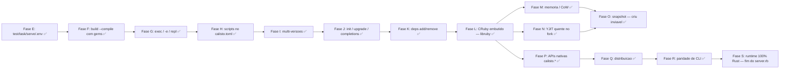

# Roadmap — calisto

> Alvo: **um Bun por inteiro para Ruby** — runtime gerenciado (CRuby pinado),
> startup fork-based, bundler, test/task/serve, build single-file com gems,
> scripts (bun run), exec (bunx), multi-versões. Cada fase tem marco
> verificável e vira teste permanente.

## Anti-objetivo nº 1: nunca reimplementar o CRuby

Como o Bun: o engine é **embutido**, não reescrito — o Bun embute
JavaScriptCore e implementa a camada em Zig; o calisto embute o CRuby
(libruby via dlopen, Fase L) e implementa a camada em Rust (daemon, CLI,
bundler, ecossistema). Reimplementar o CRuby quebraria a ABI de C extensions
(o ecossistema de gems — Rails/Sidekiq/sqlite3/pgvector), descartaria
YJIT/PRISM/GC e entregaria diferenciação zero. **O valor está na
orquestração**; detalhes por fase em `AGENTS.md`.

## Estado — ciclos fechados

- **Fases 1–2 + A–K** ✅ — runtime pinado (3.4.10) + daemon fork; gems via
  Bundler (semântica `bundle exec`); preload de app (boot congelado,
  fork-safe); Rails mínimo; escada real até **Chatwoot** (Sidekiq +
  ActionCable); produto Bun (test/task/serve/.env/watch); build --compile
  com gems (pure-Ruby + **C exts embutidas**); exec / `-e` / repl; scripts
  no calisto.toml; multi-versões (`.ruby-version`/Gemfile); init/upgrade/
  completions; add/remove/lock.
- **Ciclo L–R** ✅ — **L**: CRuby **embutido** (VM in-process via libruby,
  accept loop em Rust, `server.rb` legado-only); **M**: compactação
  pré-fork + `doctor` com smaps; **N**: YJIT quente no fork (warmup no
  daemon); **O**: snapshot fechado com decisão (spike criu: privilégio
  demais p/ dev laptop — o gap do 1º comando pós-boot fica aceito);
  **P**: APIs nativas `calisto.*` (hash sha256/blake3, sqlite); **Q**:
  distribuição (tarballs, curl|sh, upgrade com rubies pré-compilados,
  `CALISTO_HOME`); **R**: paridade de CLI (`-I/-r/-w/-W/-c/-E/-v` com
  paridade cold/warm).

## Números de hoje (marcos)

- Rails runner: Chatwoot 2162 → **108ms (20×)**; Maybe 1527 → **177ms (8.6×)**.
- `calisto test`: rspec do Chatwoot 5006 → **698ms (7.2×)**; suite do
  railsapp **<1s** quente.
- `calisto run -e` quente **36ms** (<50ms); scaffold do init **33ms**;
  `run db:migrate` 135ms; `task db:migrate` 530 → 98ms.
- Fase M: Private_Dirty de child do Chatwoot **−46%** (compactação + CoW).
- Fase N: 1º request `/cpu` 119–188ms → **6–13ms** com YJIT + warmup.
- Fase P: sha256 100MB **6.9×** o `Digest::SHA256` (SHA-NI).
- Fase L: `run -e` **37ms** no daemon embutido — o processo do daemon **é**
  o binário calisto.

## Cobertura vs `ruby`

> O calisto **embede o CRuby**: a semântica do interpretador é ~100% coberta
> por construção (paridade cold/warm + 17 arquivos do ruby/ruby upstream).
> O que falta é o CLI e comandos do ecossistema.

| Uso `ruby` | No calisto |
|---|---|
| `ruby <script>` / `ruby -e` | ✅ `calisto run` / `run -e` |
| `-I` / `-r` / `-w` / `-W` / `-c` / `-E` / `-v` | ✅ Fase R (paridade cold/warm) |
| `--yjit` | ✅ `[run] yjit` + warmup (Fase N) |
| `irb` / `rake` / rackup/puma | ✅ `repl` / `task` / `serve` |
| rspec / minitest | ✅ `calisto test` |
| binários de gems (sidekiq…) | ✅ `calisto exec` |
| `bundle` | ✅ add/remove/lock + Gemfile ativo no run |
| `gem` (instalação) | ⚠️ delegado ao `bundle install` (decisão Fase A) |
| `-n/-p/-a/-F/-l/-0/-i/-s/-S/-x/-C` | ❌ não-fazer documentado (`ruby` do vendor via PATH/--cold) |

## Próximo ciclo — Fase S: runtime 100% Rust (fim do server.rb)

> O `src/daemon/server.rb` (daemon legado em Ruby) só sobrevive para rubies
> sem `libruby.so` — o único caso real é o `vendor/ruby-3.4.4`, construído
> **antes** do `--enable-shared` (Fase L.1). Com o 3.4.4 rebuildado com
> shared, o daemon Rust embutido cobre **todas** as versões e o legado morre.

- [ ] **S.1 — rebuild do 3.4.4 com libruby.so**:
      `CALISTO_REBUILD=1 RUBY_VERSION=3.4.4 scripts/build-ruby.sh` (rebuild
      **destrutivo** — rm -rf do prefixo — e o script atual já aplica
      `--enable-shared`). Verificar
      `vendor/ruby-3.4.4/lib/libruby.so.3.4.4` + symlinks. C-exts dos
      fixtures (chatwoot/maybe, compiladas contra o 3.4.4) seguem
      compatíveis — mesma versão, mesmo ABI; o GEM_PATH (`vendor/bundle`)
      não é tocado.
- [ ] **S.2 — modo único de daemon**: `runtime.rs` decide só por
      `libruby_path()` — `CALISTO_NO_EMBED` some. Ruby sem `.so` → **erro
      claro** com o comando de rebuild (porta de entrada: instalações
      antigas pré-shared; quebra intencional, documentada).
- [ ] **S.3 — deletar o legado**: `src/daemon/server.rb` (único arquivo do
      dir — o dir some junto com o `include_str!`), o branch
      `Command::new(ruby)` do spawn (runtime.rs) e os comentários "espelho
      do server.rb" (daemon.rs/child.rs/protocol.rs) — o espelho vira
      referência histórica do git.
- [ ] **S.4 — testes**: `daemon_legacy_fallback_with_no_embed`
      (test/daemon.rs) vira teste do **erro claro** com um ruby fake sem
      `.so` (via `CALISTO_RUBY`); o 3.4.4 gated (versions.rs) passa a
      provar o **embutido** sob `.ruby-version` 3.4.4 (pidfile → exe ==
      calisto); o golden do chatwoot (realapps.rs — pina 3.4.4) passa a
      cobrir o hook de compactação **Rust** (antes cobria o legado). Grep
      final: `server.rb`/`CALISTO_NO_EMBED` = 0 em `src/`.
- [ ] **S.5 — docs**: AGENTS.md — remove `daemon/server.rb` da tabela de
      arquivos, o aviso "after editing server.rb rebuild", `CALISTO_NO_EMBED`
      dos env vars e o contrato de cobertura do daemon.rs (fallback legado)
      — o runtime 100% Rust vira o único caminho descrito.
- Marco ✅: suíte inteira verde com o legado removido; 3.4.4 embutido
  (pidfile → exe == binário calisto, gated em `vendor/ruby-3.4.4`); `run -e`
  e goldens sob 3.4.4 no daemon Rust; ruby sem `.so` → erro claro com o
  comando de rebuild.
- Estimativa: 3–5 dias (o build do 3.4.4 domina; o resto é remoção +
  ajuste de testes).

## Depois da S

- **APIs nativas novas** — `calisto.*` além de hash/sqlite (o `Bun.*` do Ruby).
- **Degraus reais completos** — validar `calisto run`/build no Chatwoot
  (a S.4 já re-ativa os goldens sob 3.4.4 embutido).
- **Snapshot gated** — se o cenário de privilégio mudar (criu + caps),
  o gancho de invalidação (hash do socket do daemon da app) já existe.

## Riscos

- **Memória**: daemon com Chatwoot pré-carregado ≈ 500MB+ RSS (preço do
  preload; CoW mitiga por fork).
- **C exts no build**: `.so` dependem das libs do sistema
  (libsqlite3/libxml2/libpq) e do ABI da plataforma; compilar continua
  delegado ao `bundle install`.
- **Windows**: impossível (fork).
- **Não fazer**: reimplementar Bundler/CRuby, compilar C exts no build (mkmf).
