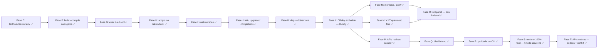

# Roadmap — calisto

> Alvo: **um Bun por inteiro para Ruby** — runtime gerenciado (CRuby pinado),
> startup fork-based, bundler, test/task/serve, build single-file com gems,
> scripts (bun run), exec (bunx), multi-versões. Cada fase tem marco
> verificável e vira teste permanente.

## Anti-objetivo nº 1: nunca reimplementar o CRuby

Como o Bun: o engine é **embutido**, não reescrito — o Bun embute
JavaScriptCore e implementa a camada em Zig; o calisto embute o CRuby
(libruby via dlopen, Fase L) e implementa a camada em Rust (daemon, CLI,
bundler, ecossistema). Reimplementar o CRuby quebraria a ABI de C extensions
(o ecossistema de gems — Rails/Sidekiq/sqlite3/pgvector), descartaria
YJIT/PRISM/GC e entregaria diferenciação zero. **O valor está na
orquestração**; detalhes por fase em `AGENTS.md`.

## Estado — ciclos fechados

- **Fases 1–2 + A–K** ✅ — runtime pinado (3.4.10) + daemon fork; gems via
  Bundler (semântica `bundle exec`); preload de app (boot congelado,
  fork-safe); Rails mínimo; escada real até **Chatwoot** (Sidekiq +
  ActionCable); produto Bun (test/task/serve/.env/watch); build --compile
  com gems (pure-Ruby + **C exts embutidas**); exec / `-e` / repl; scripts
  no calisto.toml; multi-versões (`.ruby-version`/Gemfile); init/upgrade/
  completions; add/remove/lock.
- **Ciclo L–R** ✅ — **L**: CRuby **embutido** (VM in-process via libruby,
  accept loop em Rust, `server.rb` legado-only); **M**: compactação
  pré-fork + `doctor` com smaps; **N**: YJIT quente no fork (warmup no
  daemon); **O**: snapshot fechado com decisão (spike criu: privilégio
  demais p/ dev laptop — o gap do 1º comando pós-boot fica aceito);
  **P**: APIs nativas `calisto.*` (hash sha256/blake3, sqlite); **Q**:
  distribuição (tarballs, curl|sh, upgrade com rubies pré-compilados,
  `CALISTO_HOME`); **R**: paridade de CLI (`-I/-r/-w/-W/-c/-E/-v` com
  paridade cold/warm).
- **Fase S** ✅ — runtime **100% Rust**: 3.4.4 rebuildado com
  `--enable-shared`; modo único de daemon (`CALISTO_NO_EMBED` some, ruby
  sem `.so` → erro claro com o rebuild); `server.rb` + `include_str!`
  deletados; goldens maybe/chatwoot **ativos** sob o daemon Rust (hook de
  compactação Rust: Private_Dirty −58%).
- **Fase T** ✅ — APIs nativas novas: `Calisto::Hash.xxh64` (o `Bun.hash`,
  hash não-cripto — **37×** o Digest::SHA256 em 100MB) + codecs
  `Calisto::Base64`/`Calisto::URL`/`Calisto::HTML` (paridade exata da
  stdlib, cold/warm concordando; crate `calisto-native/`).

## Números de hoje (marcos)

- Fase T: xxh64 100MB **9.3ms vs 345ms** do Digest::SHA256 (**37×**);
  codecs com paridade exata da stdlib (base64 6 métodos, CGI, ERB).

- Rails runner: Chatwoot 2162 → **108ms (20×)**; Maybe 1527 → **177ms (8.6×)**.
- `calisto test`: rspec do Chatwoot 5006 → **698ms (7.2×)**; suite do
  railsapp **<1s** quente.
- `calisto run -e` quente **36ms** (<50ms); scaffold do init **33ms**;
  `run db:migrate` 135ms; `task db:migrate` 530 → 98ms.
- Cold (1º comando): bundler/setup condicional (só com Gemfile — o ruby puro
  também não carrega bundler fora de bundle) + poll de spawn 25→2ms + preload
  default **trimado** (só módulos baratos; yaml/uri/net/http/csv ficam lazy —
  o child carrega no require on demand): cold **180→111ms**, warm **50→37ms**,
  `--cold` **66→58ms**. Preload concorrente (threads) testado e descartado: o
  GVL serializa compile+exec do require — threads só adicionam overhead
  (medido: par 125ms > seq 102ms). O resto do gap vs o ruby puro (58ms) é o
  boot do CLI do MRI + dlopen — snapshot de heap (o que Node/Bun fazem) não
  existe no CRuby (Fase O: criu exige privilégio; a decisão fica: fork do
  daemon quente).
- Fase M: Private_Dirty de child do Chatwoot **−58%** (compactação + CoW,
  revalidado no daemon Rust na Fase S; era −46% no legado).
- Fase N: 1º request `/cpu` 119–188ms → **6–13ms** com YJIT + warmup.
- Fase P: sha256 100MB **6.9×** o `Digest::SHA256` (SHA-NI).
- Fase L: `run -e` **37ms** no daemon embutido — o processo do daemon **é**
  o binário calisto.
- Fase S: 3.4.4 embutido (mesmo daemon, `run -e` e goldens); goldens
  maybe/chatwoot ativos — o `server.rb` legado morreu.

## Cobertura vs `ruby`

> O calisto **embede o CRuby**: a semântica do interpretador é ~100% coberta
> por construção (paridade cold/warm + 17 arquivos do ruby/ruby upstream).
> O que falta é o CLI e comandos do ecossistema.

| Uso `ruby` | No calisto |
|---|---|
| `ruby <script>` / `ruby -e` | ✅ `calisto run` / `run -e` |
| `-I` / `-r` / `-w` / `-W` / `-c` / `-E` / `-v` | ✅ Fase R (paridade cold/warm) |
| `--yjit` | ✅ `[run] yjit` + warmup (Fase N) |
| `irb` / `rake` / rackup/puma | ✅ `repl` / `task` / `serve` |
| rspec / minitest | ✅ `calisto test` |
| binários de gems (sidekiq…) | ✅ `calisto exec` |
| `bundle` | ✅ add/remove/lock + Gemfile ativo no run |
| `gem` (instalação) | ⚠️ delegado ao `bundle install` (decisão Fase A) |
| `-n/-p/-a/-F/-l/-0/-i/-s/-S/-x/-C` | ❌ não-fazer documentado (`ruby` do vendor via PATH/--cold) |

## Fase S — runtime 100% Rust (fim do server.rb) ✅

> O `src/daemon/server.rb` (daemon legado em Ruby) só sobrevivia para rubies
> sem `libruby.so` — o único caso real era o `vendor/ruby-3.4.4`, construído
> **antes** do `--enable-shared` (Fase L.1). Com o 3.4.4 rebuildado com
> shared, o daemon Rust embutido cobre **todas** as versões e o legado morreu.

- [x] **S.1 — rebuild do 3.4.4 com libruby.so**:
      `CALISTO_REBUILD=1 RUBY_VERSION=3.4.4 scripts/build-ruby.sh` —
      `vendor/ruby-3.4.4/lib/libruby.so.3.4.4` + symlinks presentes. As
      C-exts dos fixtures (compiladas contra o 3.4.4 estático antigo) eram
      ABI-compatíveis, mas os dirs `extensions/.../3.4.0-static/` ficaram
      invisíveis ao ruby shared (o rbconfig muda o sufixo) — os bundles dos
      fixtures foram regenerados com `bundle install` sob o ruby novo
      (libpq vendored em `vendor/src/postgresql-16.6`, libyaml vendored).
      Extra: `build-ruby.sh` porta o fix do `stdbool.h` do 3.4.10 para
      prefixos 3.4.4 (gcc 15+/c99 — ver AGENTS.md armadilhas).
- [x] **S.2 — modo único de daemon**: `runtime.rs` decide só por
      `libruby_path()` — `CALISTO_NO_EMBED` sumiu. Ruby sem `.so` → **erro
      claro** com o comando de rebuild (teste
      `ruby_without_libruby_so_errors_clearly`).
- [x] **S.3 — deletar o legado**: `src/daemon/server.rb` + `include_str!`,
      o branch `Command::new(ruby)` do spawn (runtime.rs) e os comentários
      "espelho do server.rb" (daemon.rs/child.rs/protocol.rs) removidos.
- [x] **S.4 — testes**: `daemon_legacy_fallback_with_no_embed` virou o
      teste do **erro claro** com ruby fake sem `.so`; o 3.4.4 gated
      (versions.rs) ganhou `ruby344_daemon_runs_embedded` (pidfile → exe ==
      calisto); o golden do chatwoot cobre o hook de compactação **Rust**
      (Private_Dirty **−58%**, ≥30% no assert); grep final:
      `server.rb`/`CALISTO_NO_EMBED` = 0 em `src/`. Extra (fork-safety):
      o daemon desativa o `DEBUGGER__::SESSION` pós-boot — o debug gem
      (Bundler.require do Rails dev) não sobrevive ao fork e o child
      travava no 1º script compilado (bug real achado pelo golden do maybe).
- [x] **S.5 — docs**: AGENTS.md atualizado (tabela, env vars, contrato de
      cobertura, armadilhas novas).
- Marco ✅: suíte inteira verde com o legado removido; 3.4.4 embutido
  (pidfile → exe == binário calisto, gated em `vendor/ruby-3.4.4`); `run -e`
  e goldens (maybe + chatwoot) sob 3.4.4 no daemon Rust; ruby sem `.so` →
  erro claro com o comando de rebuild.

## Fase T — APIs nativas novas (`calisto.*`, o `Bun.*` do Ruby) ✅

> Depois do hash (sha256/blake3) e do sqlite (Fase P), a Fase T cresce a
> superfície nativa com o que a stdlib Ruby **não** cobre bem: hash
> não-criptográfico (xxh64 — o `Bun.hash`) e codecs de string com
> semântica exata da stdlib (paridade cold/warm via shims com fallback
> puro). Um crate novo, `crates/calisto-native/`, registra os codecs no
> boot do daemon (rb_define_singleton_method via NativeFns, como o hash).

- [x] **T.1 — `Calisto::Hash.xxh64`** (crates/calisto-hash/src/xxh64.rs):
      one-shot fiel ao xxhash.c oficial, vetores do **sanity check oficial**
      do repo Cyan4973/xxHash (buffer determinístico com PRIME64 do
      teste — pegadinha: 0x9E3779B185EBCA8D ≠ P1 — seeds 0/PRIME32, caminhos
      tail <32 e blocos ≥32; validação cruzada com o C compilado). O
      `Bun.hash` do Ruby: 100MB em 9.3ms vs 345ms do Digest::SHA256
      (**37×**) — cache keys/sharding de Rails usam SHA256 por falta de
      hash rápido na stdlib; cold → NotImplementedError.
- [x] **T.2 — codecs** (crates/calisto-native/): `Calisto::Base64`
      (espelho do stdlib base64 0.3 — encode64 com newline a cada 60 +
      final, strict, urlsafe com `padding:` aceito como kwarg OU posicional,
      decode64 lenient com lixo/`=`/grupo parcial, strict_decode64 com
      ArgumentError "invalid base64" — mesmas regras do pack "m"/"m0",
      urlsafe_decode64 com auto-pad de entrada unpadded), `Calisto::URL`
      (CGI.escape/unescape — `~` NÃO é escapado, `+` para espaço, `%zz`
      inválido intacto, hex case-insensitive) e `Calisto::HTML.escape`
      (ERB::Util.html_escape — `&<>"'`). Nota honesta: base64/html usam
      caminhos **C** da stdlib (pack/gsub com hash) e empatam em velocidade;
      o win de velocidade real é o xxh64 e o CGI (gsub com bloco).
- [x] **T.3 — integração**: `calisto_native::register` no boot do daemon
      (obrigatório, sem degradação), shims `calisto/base64.rb`/`url.rb`/
      `html.rb` com fallback puro em cold (stdlib base64/CGI/ERB — mesma
      saída, paridade cold/warm); `rb_path2class`/kwargs-Hash detectado via
      classe resolvida no register (kwarg `padding:` vira Hash posicional
      no argc=-1; chave é SÍMBOLO).
- [x] **T.4 — testes**: vetores oficiais (blake3/xxh64), paridade
      cold/warm + stdlib em 6 métodos × 10 tamanhos (base64), semântica de
      decode lenient/strict, URL/HTML vs CGI/ERB, benchmark xxh64 ≥3×
      (**37×** medido, release).
- [x] **T.5 — docs**: AGENTS.md (status, tabelas, contrato native.rs).

## Próximos passos

- **Degraus reais completos** — validar `calisto run`/build no Chatwoot
  (os goldens já rodam sob 3.4.4 embutido; falta o degrau de build).
- **Snapshot gated** — se o cenário de privilégio mudar (criu + caps),
  o gancho de invalidação (hash do socket do daemon da app) já existe.

## Riscos

- **Memória**: daemon com Chatwoot pré-carregado ≈ 500MB+ RSS (preço do
  preload; CoW mitiga por fork).
- **C exts no build**: `.so` dependem das libs do sistema
  (libsqlite3/libxml2/libpq) e do ABI da plataforma; compilar continua
  delegado ao `bundle install`.
- **Windows**: impossível (fork).
- **Não fazer**: reimplementar Bundler/CRuby, compilar C exts no build (mkmf).
