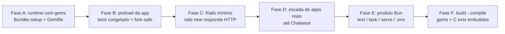

# Roadmap — calisto

> Runtime estilo Bun para Ruby: CRuby 3.4.10 pinado, daemon fork-based de startup
> rápido, bundler stdlib-only. Objetivo de longo prazo: **1:1 com o Rails** — o
> calisto como runtime/empacotador em volta de apps Rails (como o Bun roda React),
> validado rodando apps open source reais, do trivial ao Chatwoot.

## A virada de premissa (gems)

Rails **é** um conjunto de gems. "Rodar Rails" e "não mexer em gems" são mutuamente
exclusivos. A decisão que preserva o espírito do projeto (não reimplementar nada
do Ruby):

> **O calisto não passa a *gerenciar* gems — passa a *rodar* apps que usam gems,
> delegando a instalação ao Bundler normal.** O preload do daemon deixa de ser
> `json,yaml,...` e vira **a app inteira** (boot congelado + fork por execução).

Analogia: **Bun + React/Next = calisto + Rails**. O valor continua no que já existe
(daemon fork, preload, bundler, testes) — só muda o que é pré-carregado.

## Visão de produto

| Fase | Objetivo | Marco verificável | Estimativa |
|---|---|---|---|
| **A** | Runtime com ecossistema | app Rack/Sinatra (5 gems) roda via `calisto run` | 2-4 sem |
| **B** | Preload de app (frozen boot) | boot de Rails ≥2s → **<500ms** por comando | 2-3 sem |
| **C** | Rails mínimo | `rails new` + `curl` → 200, boot <500ms | 2-4 sem |
| **D** | Apps reais progressivos | escada abaixo; cada app vira **golden test** | contínuo |
| **E** | Produto Bun-completo | `calisto test` roda a suíte do app + watch | 2-3 meses |
| **F** | `build --compile` com gems | executável com gems **pure-Ruby** (sem C exts) | 2-4 meses (C exts: estelar) |

## Fases

### Fase A — Runtime com gems (porta de entrada)
- `calisto run` detecta `Gemfile` e roda com `Bundler.setup` antes do script
  (o daemon já herda `RUBYOPT`/env do cliente; falta `BUNDLE_GEMFILE` + setup)
- check de `.ruby-version` vs pin 3.4.10 (warn se divergir)
- **Decisão**: delegar ao `bundle` — nada de instalador próprio
- Golden test: fixture de app Sinatra + 5 gems → `calisto run` + curl

### Fase B — Preload de app (coração do "1:1 Rails")
- O daemon pré-carrega o entrypoint da app (ex.: `config/environment.rb`) no
  lugar do preload de stdlib — configuração por app via **`calisto.toml`** (novo)
- **Fork-safe boot**: desconectar conexões `ActiveRecord` no preload, reconnect
  no child (padrão Zeus/Spring); verificar caches/locks/threads pós-fork
- Métrica alvo: `rails runner`/`rake`/testes ~2-5s → **200-400ms**
- Custo conhecido: daemon com app Rails ≈ 300-500MB RSS (preço do preload)

### Fase C — Rails mínimo
- `rails new` (sqlite, sem asset pipeline) roda: `calisto run bin/rails ...`,
  console e dev server via rack handler
- Servidor web roda como child do fork (threads OK — fork é single-threaded)

### Fase D — Escada de apps reais (golden tests)

| Degrau | App | Gems | Valida |
|---|---|---|---|
| 1 | scripts CLI stdlib-only | 0 | já funciona ✓ |
| 2 | app Rack/Sinatra | ~5 | Fase A |
| 3 | Rails blog mínimo (sqlite) | ~15 | Fase C |
| 4 | app média com Sidekiq (ex.: Maybe Finance, plataforma de conteúdo) | ~40 | fork-safe com jobs + threads |
| 5 | **Chatwoot** | ~100+ | boot + login + conversas + ActionCable (Postgres/Redis via docker) |

Cada degrau vira um golden test permanente (boot + smoke HTTP + endpoints-chave),
como a suíte upstream de hoje (`test/ruby_upstream.rs`).

### Fase E — Produto Bun
`calisto test` (minitest/rspec + paralelo + watch), `calisto task` (rake),
`calisto serve`, `.env`, hot reload. Módulos já esboçados em
`crates/calisto-{test,task,serve,sqlite,tooling}/`.

### Fase F — Build --compile com gems
- Gems **pure-Ruby**: embutem no bundle existente (loader já intercepta `require`)
- **C extensions** (nokogiri, pg, …): exigem compile + link no build — o item
  "década" do roadmap; só para apps sem C exts; provavelmente nunca para Rails
  completo (bun levou anos com time full-time)

## Riscos técnicos conhecidos
- **Fork + ActiveRecord/threads**: conexões de DB herdadas no fork — problema nº 1
  (resolvível, padrão conhecido do Zeus/Spring)
- **Memória**: daemon com Chatwoot pré-carregado ≈ 500MB+ RSS
- **Frontend do Chatwoot** (React/Vite): fora do escopo — o calisto é o backend
- **Pin único 3.4.10**: apps com `.ruby-version` diferente pedem múltiplos rubies
  no calisto (feature futura)
- **Não fazer**: reimplementar Bundler, bundle de C exts no curto prazo, Windows
  (fork)

## Estado atual (2026-08-06)

Feito: runtime pinado + daemon fork (startup 3-4×), `calisto build` stdlib-only,
suíte própria + 17 arquivos de teste do ruby/ruby v3_4_10 com paridade.
**Fase A (gems) concluída**: `calisto run` ativa o Gemfile do cwd via
`Bundler.setup` (semântica `bundle exec`; cold com `-rbundler/setup`), warn de
`.ruby-version` divergente, preload stdlib desativado quando há Gemfile
(conflito default-gem versão diferente, ex. base64 0.2→0.3 do Sinatra 4).
Golden tests: `test/fixtures/gemapp` (5 gems default/bundled, hermético, lock
commitado) + `test/fixtures/sinatraapp` (Sinatra+Puma servindo HTTP via
`calisto run` + curl; gated em `bundle install` prévio).
Próximo: **Fase B** (preload de app — boot congelado + fork-safe).
